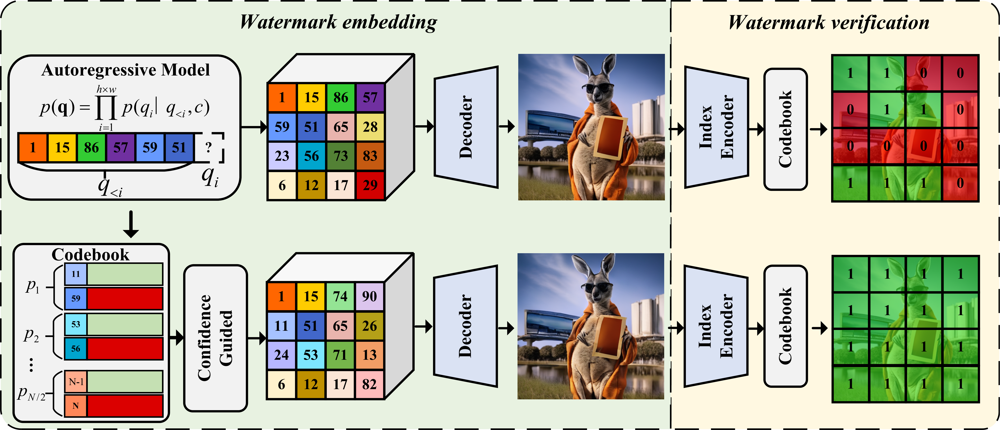

<h1 align="center">IndexMark: Training-Free Watermarking for Autoregressive Image Generation</h1>

<p align="center">
          🤗 <a href="https://huggingface.co/maifoundations/IndexMark">Hugging Face</a>&nbsp&nbsp | &nbsp&nbsp 📑 <a href="https://arxiv.org/pdf/2505.14673">Paper</a> &nbsp&nbsp | &nbsp&nbsp 📖 <a href="https://www.maifoundations.com/blog/indexmark/">Blog</a> &nbsp&nbsp 
</p>
<p align="center">

<p>

This repo is the official implementation of the paper 'Training-Free Watermarking for Autoregressive Image Generation'.

## 📰 News
* **`[2025/06/03]`:**🔥**Model checkpoints are available at [[🤗HuggingFace](https://huggingface.co/maifoundations/IndexMark)].**
* **`[2025/05/20]`:**🔥**We have released our paper [[Arxiv](https://arxiv.org/pdf/2505.14673)].**

## ✈️ About
We introduce IndexMark, a training-free watermarking framework for autoregressive image generation models. It embeds watermarks by replacing generated indices with similar ones, thereby maintaining image quality and demonstrating robustness against various perturbations.

## 🌿 Requirements
To set up the environment based on [LlamaGen](https://github.com/FoundationVision/LlamaGen), please download the corresponding files for VQ-VAE models and AR models.

## 🦄 Watermark embedding
### Class-Conditional Image Generation Watermark
#### 256 Resolution
For 256 resolution class-conditional watermark generation, you can run:
```
python generation_c2i.py --gpt-model GPT-L --gpt-ckpt path/c2i_L_256.pt --image-size 256 --vq-ckpt path/vq_ds16_c2i.pt --save-dir path/Gen_Image_c2i --mapping-save-path path/codebook_index_mapping_knn10_mwpm_c2i.json --pairs-save-path path/codebook_pairs_knn10_mwpm_c2i.json
```

#### 384 Resolution
For 384 resolution class-conditional watermark generation, you can run:
```
python generation_c2i.py --gpt-model GPT-XL --gpt-ckpt path/c2i_XL_384.pt --image-size 384 --vq-ckpt path/vq_ds16_c2i.pt --save-dir path/Gen_Image_c2i --mapping-save-path path/codebook_index_mapping_knn10_mwpm_c2i.json --pairs-save-path path/codebook_pairs_knn10_mwpm_c2i.json
```

### Text-conditional image generation Watermark
#### 256 Resolution
For 256 resolution text-conditional watermark generation, you can run:
```
python generation.py --t5-path path/t5-ckpt --gpt-ckpt path/t2i_XL_stage1_256.pt --vq-ckpt path/vq_ds16_t2i.pt --mapping-save-path path/codebook_index_mapping_knn10_mwpm.json --pairs-save-path path/codebook_pairs_knn10_mwpm.json --image-size 256 --save-dir path/Gen_Image
```

#### 512 Resolution
For 512 resolution text-conditional watermark generation, you can run:
```
python generation.py --t5-path path/t5-ckpt --gpt-ckpt path/t2i_XL_stage2_512.pt --vq-ckpt path/vq_ds16_t2i.pt --mapping-save-path path/codebook_index_mapping_knn10_mwpm.json --pairs-save-path path/codebook_pairs_knn10_mwpm.json --image-size 512 --save-dir path/Gen_Image
```

## 🚀 Watermark verification
### Class-Conditional Image Generation Watermark
For watermark verification of class-conditional images, you can run:
```
python verification.py --vq-ckpt path/vq_ds16_c2i.pt --mapping-save-path path/codebook_index_mapping_knn10_mwpm_c2i.json --pairs-save-path path/codebook_pairs_knn10_mwpm_c2i.json --index-encoder path/encoder_finetuned_target_zq_epoch_70.pt --image-directory path/Gen_Image_c2i/100%
```
### Text-conditional image generation Watermark
For watermark verification of text-conditional images, you can run:
```
python verification.py --vq-ckpt path/vq_ds16_t2i.pt --mapping-save-path path/codebook_index_mapping_knn10_mwpm.json --pairs-save-path path/codebook_pairs_knn10_mwpm.json --index-encoder path/encoder_finetuned_target_zq_epoch_70.pt --image-directory path/Gen_Image/100%-256
```
We have trained specific IndexMark models for different resolutions, and you can also only use an IndexMark for a specific resolution.

## ⚡ License
The majority of this project is licensed under MIT License. Portions of the project are available under separate license of referred projects, detailed in corresponding files.

## 🎓 Citation
```
@article{tong2025training,
  title={Training-Free Watermarking for Autoregressive Image Generation},
  author={Tong, Yu and Pan, Zihao and Yang, Shuai and Zhou, Kaiyang},
  journal={arXiv preprint arXiv:2505.14673},
  year={2025}
}
```
